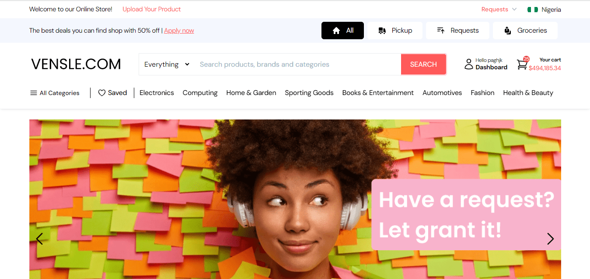

# Vensle

Vensle is a location-based classified site and grocery ecommerce platform that empowers local communities by facilitating easy buying and selling of products. It merges the convenience of classifieds with the structured approach of ecommerce to create a seamless user experience.

<!-- Replace with an actual screenshot URL of your application -->

## Introduction

Visit the [Deployed Site](https://nominet.vensle.com/)

[Landing page](http://home.vensle.com/)

[Figma prototype](https://www.figma.com/proto/QVoxMNkcQW8mB2HbNdXv5s/Vensle?node-id=913-182100&scaling=scale-down-width&page-id=908%3A181102&starting-point-node-id=913%3A182847&content-scaling=fixed&hide-ui=1)

Read the [Final Project Blog Article](https://olshea.hashnode.dev/building-vensle-a-location-based-marketplace)

Connect with the [Author on LinkedIn](https://www.linkedin.com/in/john-akala-4b42075a/)

## Installation

To get started with Vensle locally, follow these steps:

1. Clone the repository: `git clone https://github.com/JohnOlshea/vensle.git`
2. Navigate into the project directory: `cd vensle`
3. cd frontend
4. Install dependencies: `npm install`
5. npm start
6. cd backend
7. composer install
8. cp .env.example .env
9. php artisan key:generate
10. php artisan migrate
11. php artisan serve

## Usage

### Development

For local development:

1. Start the frontend React application: `npm start`
2. Start the Laravel backend server: `php artisan serve`

### Production

Deploying Vensle to production requires configuring your production environment and ensuring all dependencies are properly installed and secured.

## Contributing

We welcome contributions to Vensle! To contribute:

1. Fork the repository
2. Create your feature branch: `git checkout -b feature/NewFeature`
3. Commit your changes: `git commit -am 'Add NewFeature'`
4. Push to the branch: `git push origin feature/NewFeature`
5. Submit a pull request

## Related Projects

- [Pusher](https://pusher.com/) - Real-time communication APIs
- [Stripe](https://stripe.com/) - Payment processing for ecommerce
- [React](https://reactjs.org/) - JavaScript library for building user interfaces
- [Laravel](https://laravel.com/) - PHP framework for web artisans

## Licensing

This project is licensed under the MIT License - see the [LICENSE.md](LICENSE.md) file for details.

---

### Technical Depth

#### Real-Time Messaging with Pusher

One of the core technical challenges I faced was implementing real-time messaging between users. I chose Pusher for its simplicity and robust functionality in handling WebSocket communication. Integrating Pusher required careful consideration of message ordering, ensuring that all users receive messages in the correct sequence across devices and browsers. This involved optimizing backend architecture for message queuing and implementing retry mechanisms for reliable message delivery.

#### Secure Payment Integration with Stripe

To enable secure online payments for groceries, I integrated Stripe, leveraging its powerful API for handling transactions. Security was paramount, and I ensured that all transactions are encrypted and compliant with PCI DSS standards. Implementing Stripe involved configuring webhooks for real-time payment updates and managing customer and payment information securely.

### Future Iterations

Looking ahead, I envision expanding Vensle's features to include AI-powered product recommendations based on user preferences and refining the user interface for an even more intuitive experience. Additionally, optimizing backend performance and scalability will be a focus to accommodate a growing user base and ensure seamless operation during peak times.

### Lessons Learned

Through Vensle, I've deepened my understanding of full-stack development, mastering technologies like React for frontend interactivity and Laravel for robust backend services. I've learned the importance of user-centric design and iterative development, constantly refining features based on user feedback and market demands.

### Conclusion

Vensle represents not just a technical achievement but a testament to my passion for empowering local economies through technology. By combining innovative solutions with a user-first approach, I aim to continue evolving Vensle into a platform that transforms how communities buy and sell goods online.
